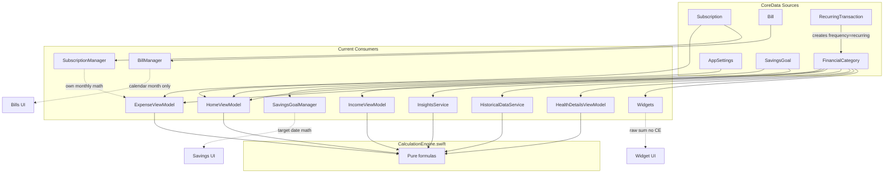
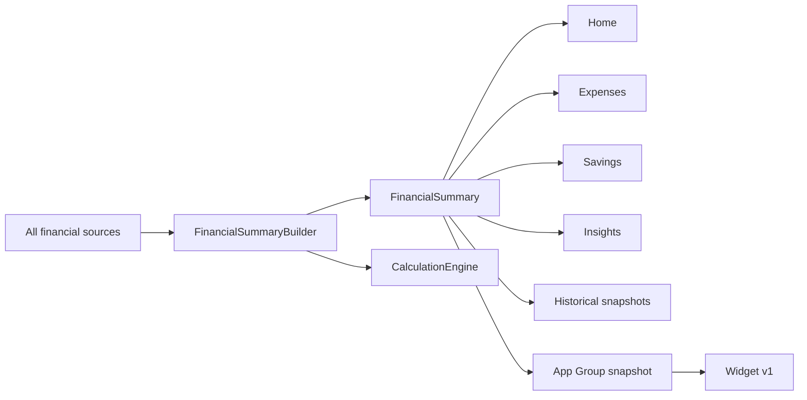

# Phase 1 — Calculation Engine Contract Report

**Date:** 2026-06-16  
**Phase:** 1 — Calculation Engine Contract (documentation only)  
**Sources:** `docs/product_decisions_v1.md`, `docs/implementation/calculation_engine_contract_plan.md`, `docs/implementation/phase0_codebase_audit_report.md`, current Swift codebase (read-only inspection)

---

## Executive Summary

BudgetMeter’s core product promise is a **single financial pace**: Home, savings, charts, and widgets must show the same net movement at the same time. Today that promise is **not met in code**.

`CalculationEngine.swift` is a strong, stateless formula library and is the closest thing to a shared engine. However, **each consumer builds its own inputs** from different CoreData sources, with different inclusion rules, and several surfaces calculate money independently. The largest gaps:

| Gap | Impact |
| --- | --- |
| Home reads `FinancialCategory` only (`daily` / `monthly` / `yearly`) | Excludes subscriptions, bills, and `frequency == "recurring"` rows |
| Expenses adds active subscriptions on top of categories | Expense tab totals can exceed Home totals |
| Widgets sum raw category amounts with no normalization | Widget values can disagree sharply with Home |
| Savings uses two systems | Home `AppSettings` + `targetTime`; `SavingsGoalManager` uses calendar-month target-date math |
| No one-time vs recurring distinction in storage | Product rules for period-only one-time entries cannot be enforced yet |
| Tests exist on disk but do not run | No CI guardrail before refactor |

**Phase 1 outcome:** This report defines the **target contract** (what to build) and maps **current behavior** (what exists). Implementation should not start changing Swift until Phase 2 data-model safety clarifies how one-time entries, bills, and subscriptions map into the shared input model.

**Recommendation:** **Ready for calculation implementation** — the contract is clear enough to implement behind tests. **Phase 2 (Data Model Safety) is a hard prerequisite** for one-time/recurring behavior and rollup consistency because the schema does not yet encode occurrence dates or entry kind.

---

## Contract Questions — Direct Answers

### 1. What calculations exist today?

**In `CalculationEngine.swift` (shared, stateless):**

| Category | Functions |
| --- | --- |
| Constants | `daysPerMonth` (30.4375), `daysPerYear` (365.25), `hoursPerDay` (24), seconds helpers |
| Monthly totals | `totalMonthlyIncome`, `totalMonthlyExpense` |
| Daily totals | `dailyIncomeTotalConverted`, `dailyExpenseTotal` |
| Interval expense/income | `hourlyExpense/Income`, `weeklyExpense/Income` |
| Net flow | `netFlow` (monthly), `netDailyFlow`, `netHourlyFlow`, `netWeeklyFlow`, `netYearlyFlow` |
| Live session meter | `calculateLiveIncome`, `calculateLiveExpense`, `calculateLiveNetFlow` |
| Health (legacy 1–10) | `financialHealthScore` |
| Health (0–100) | `calculateFinancialHealthScore`, `calculateHealthScoreBreakdown`, `generateHealthTips`, `healthScoreText` |
| Savings timeline | `targetTime(targetAmount:netHourlyFlow:)` |
| **Missing vs product** | No `netMinuteFlow`, no biggest-drain API, no period comparison API, no one-time/recurring split |

**Outside `CalculationEngine` (duplicate or parallel logic):**

| Location | What it calculates |
| --- | --- |
| `HomeViewModel` | Aggregates categories → engine; live meter timer; daily budget (calendar days left); mock charts/trends; savings time via `targetTime` |
| `IncomeViewModel` | Category totals → engine; daily avg = monthly / `daysPerMonth`; yearly = monthly × 12 |
| `ExpenseViewModel` | Category totals → engine **+ subscriptions**; same avg/yearly projections |
| `InsightsService` | Category aggregation (copy of Home pattern); spending breakdown; biggest category; savings rate |
| `HistoricalDataService` | Same category aggregation for snapshots |
| `HealthDetailsViewModel` | Same category aggregation for 0–100 health score |
| `SubscriptionManager` | `getTotalMonthlyCost`, per-subscription `calculateMonthlyCost` (uses 4.33 weeks, 30-day month for custom) |
| `BillManager` | Calendar-month due/paid totals (not pace rollup) |
| `SavingsGoalManager` | Progress %, required monthly by target date, pace status heuristic |
| `SavingsGoalInputView` | Inline `remaining / months` preview |
| `RecurringTransactionsViewModel` | Creates `FinancialCategory` with `frequency = "recurring"` (excluded from Home totals) |
| `BudgetMeterWidgets.swift` | Raw sum of all income/expense category amounts (no frequency math) |
| `CombinedBalanceSavingsWidget.swift` | Same raw-sum pattern |

### 2. Which files calculate money independently?

Files that **fetch CoreData and compute totals without going through one shared summary builder**:

1. `HomeViewModel.swift` — category rollups + local daily-budget/trend/chart logic  
2. `IncomeViewModel.swift` — income rollups  
3. `ExpenseViewModel.swift` — expense rollups + subscriptions  
4. `InsightsService.swift` — insights, breakdown, biggest category  
5. `HistoricalDataService.swift` — snapshot totals  
6. `HealthDetailsViewModel.swift` — health score inputs  
7. `SubscriptionManager.swift` — subscription monthly normalization  
8. `BillManager.swift` — calendar-month bill sums  
9. `SavingsGoalManager.swift` — target-date savings pace  
10. `SavingsGoalInputView.swift` — form preview math  
11. `RecurringTransactionsViewModel.swift` — writes categories, no shared rollup  
12. `Widgets/BudgetMeterWidgets.swift` — independent widget math  
13. `Widgets/CombinedBalanceSavingsWidget.swift` — independent widget math  
14. `Widgets/LockScreenWidgets.swift` — same pattern (lock-screen providers)

**Authoritative for formulas (when inputs match):** `CalculationEngine.swift` only.

### 3. Where can Home, Expenses, Savings, Widgets, Bills, Subscriptions, and Recurring disagree?

| Surface A | Surface B | Disagreement cause |
| --- | --- | --- |
| Home | Expenses | Home excludes `Subscription` entity; Expenses adds `SubscriptionManager.getTotalMonthlyCost()` |
| Home | Widgets | Home normalizes by frequency; widgets sum raw `amount` fields |
| Home | Insights charts | Same category-only pipeline, but Insights `calculateSpendingBreakdown` ignores subscriptions and `frequency == "recurring"` |
| Home | Recurring | Processed recurring rows use `frequency = "recurring"`, filtered out of Home/Income/Expense frequency buckets |
| Expenses | Subscriptions tab | Both use `SubscriptionManager`, so these align with each other |
| Home savings | Savings Goals feature | Home: `AppSettings.savingsGoalAmount` + `CalculationEngine.targetTime`; Goals: `SavingsGoalManager.calculateRequiredMonthlyContribution` (calendar months to target date) |
| Home | Widget savings | Widget treats `income − expense` (raw sums) as “current savings”; Home uses goal amount + pace-based ETA |
| Bills | Home pace | Bills track due/paid in calendar month only; not rolled into Home net pace at all |
| Expense monthly | Insights `totalMonthlyExpense` | Insights sums breakdown categories only (no subscriptions); ExpenseViewModel includes subscriptions |
| Historical snapshots | Home | Snapshots use category-only engine path; same as Home today, but will drift if Home adds rollups first without snapshot update |

### 4. What should be the single shared financial summary model?

Introduce **`FinancialSummary`** (output read model) built by one **`FinancialSummaryBuilder`** (or service) in CoreKit. All product surfaces consume this type; none re-aggregate CoreData independently.

```swift
// Contract shape (documentation only — not implemented in Phase 1)

struct FinancialSummary {
    let generatedAt: Date
    let currencyCode: String

    // Long-term recurring pace (baseline)
    let recurringIncomeDaily: Double
    let recurringExpenseDaily: Double
    let netRecurringDaily: Double

    // Derived pace intervals (from netRecurringDaily)
    let netPacePerMinute: Double
    let netPacePerHour: Double
    let netPacePerDay: Double      // default Home emphasis
    let netPacePerWeek: Double
    let netPacePerMonth: Double

    // Selected period overlay (includes one-time items for that period)
    let selectedPeriod: PeriodKind
    let periodStart: Date
    let periodEnd: Date
    let oneTimeIncomeInPeriod: Double
    let oneTimeExpenseInPeriod: Double
    let netPeriodResult: Double    // recurring normalized to period + one-time actuals

    // Totals for display
    let totalRecurringIncomeMonthly: Double
    let totalRecurringExpenseMonthly: Double
    let netRecurringMonthly: Double

    // Health / status
    let paceStatus: PaceStatus     // forward / slowing / neutral
    let healthScoreSimple: Int     // legacy 1–10 if still shown
    let healthScoreDetailed: Int   // 0–100 premium detail

    // Rankings & comparisons
    let biggestDrain: DrainItem?   // name, amount, categoryKey, isRecurring
    let previousPeriodNet: Double?
    let periodComparisonDelta: Double?
    let periodComparisonAvailable: Bool

    // Savings (basic v1)
    let savingsTargetAmount: Double
    let savingsCurrentAmount: Double   // default 0
    let savingsRemaining: Double
    let savingsTimeToTarget: TargetTimeResult?  // from netPacePerHour

    // Live meter (session)
    let liveSessionNet: Double
    let cumulativeNet: Double

    // Chart series (same source as above)
    let chartSeries: [ChartPoint]
}

enum PeriodKind { case minute, hour, day, week, month, custom }

enum PaceStatus { case movingForward, slowingDown, neutral, insufficientData }

struct DrainItem {
    let label: String
    let categoryKey: String
    let amountInPeriod: Double
    let shareOfExpense: Double
}
```

### 5. Which data types should feed the shared summary?

**Input DTO: `FinancialSummaryInput`**

| Source entity / record | Maps to | Inclusion in baseline pace | Inclusion in period totals |
| --- | --- | --- | --- |
| `FinancialCategory` (`type=income`, recurring frequencies) | Recurring income line | Yes — normalize to daily | Yes — per normalization |
| `FinancialCategory` (`type=expense`, recurring frequencies) | Recurring expense line | Yes | Yes |
| `FinancialCategory` with future `entryKind=oneTime` + `occurrenceDate` | One-time line | **No** baseline | Yes — only in matching period |
| `Subscription` (active) | Recurring expense line | Yes — normalize billing cycle to daily | Yes |
| `Bill` (active recurring) | Recurring expense line | Yes — normalize bill frequency to daily | Yes |
| `BillPayment` / paid one-off bills | One-time expense event | No baseline | Yes — payment date period |
| `RecurringTransaction` | Source rule, not direct total | When processed: emit recurring line OR one-time event per product rule (Phase 2) | Per emitted record |
| `AppSettings` | Currency, cumulative baseline, basic savings target | Meta | Savings fields |
| `SavingsGoal` (v1: primary active goal) | Target/current for display | Meta | Savings progress only |
| `FinancialSnapshot` | Historical comparison only | Read for period-over-period | Not mixed into live pace |

**Frequency mapping (product contract):**

| Stored frequency | Daily normalization |
| --- | --- |
| Daily | `amount` |
| Weekly | `amount / 7` |
| Monthly | `amount / 30.4375` |
| Yearly | `amount / 365.25` |

Legacy `FinancialCategory.frequency` values `daily`, `monthly`, `yearly` map directly. **`recurring` is not a product frequency** — it is a storage artifact and must be mapped to a real cycle in Phase 2.

### 6. How should daily/monthly/yearly normalization work?

**Two layers — do not conflate them:**

**A. Long-term recurring baseline (pace)**

1. Convert every active recurring income/expense line to **daily** using the product table above.  
2. Sum → `recurringIncomeDaily`, `recurringExpenseDaily`.  
3. `netRecurringDaily = recurringIncomeDaily − recurringExpenseDaily`.  
4. Derive other intervals from daily (Section 7).

**B. Monthly/yearly display totals (for cards)**

Use existing engine formulas on **recurring buckets only**:

- `totalMonthlyIncome = (dailyRecurringIncome × 30.4375) + monthlyRecurringIncome + (yearlyRecurringIncome / 12)`  
- `totalMonthlyExpense` — same pattern  
- `netRecurringMonthly = totalMonthlyIncome − totalMonthlyExpense`  
- `netRecurringYearly` via `netYearlyFlow` or `netRecurringDaily × 365.25`

**Constants:** Always `CalculationEngine.daysPerMonth` (30.4375) and `CalculationEngine.daysPerYear` (365.25). **Deprecate** ad-hoc `× 30`, `× 4.33`, `× 12` in managers unless they delegate to the engine.

### 7. How should minute/hour/day/week/month pace be derived?

**Source of truth:** `netRecurringDaily` from Section 6A.

| Interval | Formula |
| --- | --- |
| Minute | `netRecurringDaily / 1440` |
| Hour | `netRecurringDaily / 24` (= `CalculationEngine.netHourlyFlow` when inputs are bucketed correctly) |
| Day | `netRecurringDaily` (= `CalculationEngine.netDailyFlow`) |
| Week | `netRecurringDaily × 7` |
| Month | `netRecurringDaily × 30.4375` |

**Product rules:**

- **Default Home emphasis:** Day (`netPacePerDay`).  
- **Minute:** Secondary live metric only; may also use session live meter (`calculateLiveNetFlow`) for “since you opened the app” but must be labeled differently from baseline pace.  
- **Premium advanced forecasting:** May add history-based projections but **must not alter** `netRecurringDaily`.

**Live meter (session):** Keep `calculateLiveIncome/Expense/NetFlow` for elapsed seconds, but expose separately as `liveSessionNet`, not as long-term pace.

### 8. How should one-time income/expense affect only the selected/current period?

**Product rule:** One-time entries affect period reality and history; they **do not** change long-term recurring baseline.

**Contract behavior:**

| Concern | Rule |
| --- | --- |
| Baseline pace | Ignore one-time entries |
| Selected period net | `netPeriodResult = normalizedRecurringForPeriod + oneTimeIncomeInPeriod − oneTimeExpenseInPeriod` |
| Period average view | If showing daily average within a period: `oneTimeTotalInPeriod / daysInPeriod` **for that period view only** |
| After period ends | One-time amounts drop out of future baseline and future period defaults |
| Charts | Bucket by `occurrenceDate` |
| Biggest drain | Include one-time amounts in their occurrence period, grouped by category |

**Current blocker:** `FinancialCategory` has no `entryKind` or `occurrenceDate`. Until Phase 2 adds these (or equivalent), one-time behavior **cannot be implemented correctly** — treat all category amounts as recurring baseline (current behavior).

### 9. How should recurring income/expense affect long-term pace?

All **active recurring** lines (including subscriptions and recurring bills mapped to expense lines) normalize to daily and sum into baseline pace.

**Rules:**

- Active flag respected (`Subscription.isActive`, bill/recurring not archived).  
- Paused subscriptions excluded.  
- Duplication guard: if the same cost exists as both `FinancialCategory` and `Subscription`, **dedupe by stable source ID** (Phase 2 mapping).  
- `RecurringTransaction` automation: when it creates entries, those entries must use real frequencies or linked subscription/bill records — not orphan `frequency = "recurring"` rows.

### 10. How should subscriptions and bills roll into expense totals?

**Product:** Subscriptions and bills are specialized **fixed/regular expenses**. They roll into the same totals, biggest drain, charts, and Home pace.

**Normalization contract:**

| Source | Cycle | Daily expense contribution |
| --- | --- | --- |
| Subscription monthly | `amount / 30.4375` | |
| Subscription yearly | `amount / 365.25` | |
| Subscription weekly | `amount / 7` | |
| Subscription custom N days | `amount / N` | |
| Bill monthly | `amount / 30.4375` | |
| Bill yearly | `amount / 365.25` | |
| Bill quarterly | `amount / (30.4375 × 3)` or `amount / 91.3125` | |

**Replace** `SubscriptionManager.calculateMonthlyCost` special cases (`× 4.33`, `× 30`) with engine-backed normalization.

**Bills calendar UI** (`getTotalDueThisMonth`, paid/unpaid) remains a **management view** — not the pace engine. Pace uses normalized recurring bill amount, not “due this calendar month only.”

**Expense tab subtotal:** `totalRecurringExpenseMonthly` from shared summary (includes subscriptions/bills), not a local recompute.

### 11. How should savings time-to-goal be calculated from Home net pace?

**v1 basic savings contract (from product decisions):**

```
remaining = max(0, targetAmount - currentSavedAmount)   // currentSaved defaults to 0
netHourlyPace = netRecurringDaily / 24                  // same as Home hero pace
result = CalculationEngine.targetTime(
    targetAmount: remaining,
    netHourlyFlow: netHourlyPace
)
```

**Rules:**

- Use **recurring net pace only** (not one-time period spikes).  
- If `netHourlyPace <= 0`, show localized negative-flow message (existing `targetTime` behavior).  
- Display unit picks hours/days/months/years from `TargetTimeResult` (existing Home formatting).  
- **Do not** use `SavingsGoalManager.calculateRequiredMonthlyContribution` for Home basic ETA. That target-date formula is premium/advanced goal tracking.  
- Single v1 source of truth for basic target: resolve dual `AppSettings.savingsGoalAmount` vs `SavingsGoal` in Phase 6; until then, contract says **primary active `SavingsGoal` wins, legacy AppSettings is fallback**.

### 12. How should biggest drain be calculated?

**Product:** Highest expense category/source in the **selected period**, combining recurring (normalized to period) and one-time (actual dated amounts).

**Algorithm contract:**

1. Build expense lines for selected period with amounts in period currency.  
2. For recurring: `dailyNormalized × daysInPeriod` (or prorate partial periods).  
3. For one-time: full amount if `occurrenceDate` falls in period.  
4. Group by `categoryKey` (include subscription name / bill category as source label).  
5. Sort descending by `amountInPeriod`.  
6. `biggestDrain = first item` if amount > 0.  
7. Include subscriptions and bills in grouping — not just `FinancialCategory`.

**Current code:** `InsightsService.calculateSpendingBreakdown` — categories only, monthly equivalents, no subscriptions/bills/one-time — **not contract-compliant**.

### 13. What should widgets read later?

**v1 widget scope (product):** Premium Home Screen `systemSmall` only — net daily pace status + value, deep link to Home hero, locked teaser for non-premium.

**Data contract:**

Widgets must read a **serialized snapshot of `FinancialSummary`**, not CoreData directly.

| Field | Widget use |
| --- | --- |
| `netPacePerDay` | Primary displayed value |
| `paceStatus` | Positive/negative/slowing copy |
| `currencyCode` | Formatting |
| `generatedAt` | Stale indicator / refresh policy |
| Premium flag | From entitlements/settings — show teaser vs value |

**Do not show in v1 widget:** raw balance (`income − expense` sums), savings progress ring, charts, lock-screen variants, medium/large families.

**Delivery mechanism (Phase 8):** App Group shared container written by main app after each summary rebuild; widget extension reads snapshot only.

### 14. What tests are required before refactoring?

**Gate:** Enable `budgetmeter.iosTests` target in Xcode (Phase 2+ project edit) so tests actually run.

**Test matrix:**

| Area | Tests to add/update |
| --- | --- |
| Normalization | Daily/weekly/monthly/yearly → daily for income and expense |
| Interval derivation | minute/hour/day/week/month from same daily net |
| Recurring rollup | Categories + subscriptions + bills → same monthly total as engine |
| Dedup | Same cost in category + subscription counted once |
| One-time period | One-time affects period net, not baseline pace (after Phase 2 schema) |
| Biggest drain | Mixed recurring + one-time by category; subscriptions included |
| Savings timeline | `remaining` with `currentSaved=0`; negative pace message |
| Home vs summary | HomeViewModel displays match `FinancialSummary` fields (integration) |
| Expense vs summary | Expense totals match summary expense fields |
| Widget snapshot | Widget provider reads snapshot; matches `netPacePerDay` |
| Live meter | 86400s live net ≈ daily net (existing `testConsistency_LiveMeterMatchesSnapshot`) |
| Regression | Keep 53 existing `CalculationEngineTests` passing |
| ViewModel | Replace tests that assume `× 30` with `daysPerMonth` |

**Fix existing test drift:** `ViewModelCalculationTests` compares engine to `(daily × 30)` — update to `CalculationEngine.daysPerMonth` when tests are next touched.

### 15. What must not be touched until Phase 2 or later?

| Item | Earliest phase |
| --- | --- |
| CoreData schema (`FinancialCategory` entry kind, dates, stable IDs) | Phase 2 |
| CloudKit removal / Supabase sync | Phase 9 |
| Home UI redesign | Phase 3 |
| DesignSystem token rollout | Phase 4 |
| Income/expense entry flow changes | Phase 5 |
| Savings dual-source cleanup | Phase 6 |
| Premium gating centralization | Phase 7 |
| Widget extension target + App Group wiring | Phase 8 |
| Xcode project / test target setup | Phase 2 (when explicitly approved) |
| Mock chart/trend removal in Home | Phase 3 |
| `SavingsGoalManager` pace heuristics alignment | Phase 6 |

**Phase 1 explicitly did not change:** any Swift, tests, CoreData, or Xcode files.

---

## Current Calculation Map



**Target map (post-implementation):**



---

## Duplicate Calculation List

| # | Location | Duplicate of | Severity |
| --- | --- | --- | --- |
| 1 | `InsightsService.getCurrentFinancialData` | `HomeViewModel.loadAllData` aggregation | High |
| 2 | `HistoricalDataService` snapshot fetch | Same six-bucket category rollup | High |
| 3 | `HealthDetailsViewModel` load | Same six-bucket rollup | Medium |
| 4 | `ExpenseViewModel.totalMonthlyExpenses` | Engine + subscription side-channel | High |
| 5 | `SubscriptionManager.calculateMonthlyCost` | Engine normalization with different constants | High |
| 6 | `InsightsService.calculateSpendingBreakdown` | Partial engine (`daysPerMonth` / `/12`) without shared builder | Medium |
| 7 | `HomeViewModel.calculateDailyBudget` | Recomputes monthly totals already in snapshot | Low |
| 8 | `HomeViewModel.generateChartData` / `calculateTrendPercentage` | Mock/random — not real calculations | High (product risk) |
| 9 | Widget providers `createBalanceEntry` / `createSpendingEntry` / `createSavingsEntry` | Independent raw sums | Critical |
| 10 | `SavingsGoalManager.calculateRequiredMonthlyContribution` | Competes with `CalculationEngine.targetTime` | High |
| 11 | `SavingsGoalInputView` monthly preview | Third savings formula | Medium |
| 12 | `IncomeViewModel` / `ExpenseViewModel` daily avg | `totalMonthly / daysPerMonth` — OK if totals match summary | Low |

---

## Current Disagreement Risks

### Critical (user-visible wrong numbers)

1. **Widget balance ≠ Home net pace** — widgets sum raw amounts; Home normalizes frequencies.  
2. **Expenses total ≠ Home expense display** — subscriptions included only in Expenses.  
3. **Recurring automation invisible to Home** — `frequency = "recurring"` excluded from pace.  

### High (feature mistrust)

4. **Savings ETA differs** between Home card and Savings Goals detail (net pace vs calendar-month requirement).  
5. **Biggest drain omits subscriptions/bills** in Insights.  
6. **Charts/trends on Home are mock data** — random variance, not financial truth.  

### Medium (future drift)

7. **Historical snapshots** omit subscriptions — comparisons stay wrong after Home fix unless snapshots use shared builder.  
8. **Subscription weekly/custom cycles** use 4.33 / 30-day approximations vs engine constants.  
9. **Dual savings sources** (`AppSettings` + `SavingsGoal`) can show different targets.  

---

## Proposed Shared Input Model

```swift
struct FinancialSummaryInput {
    let currencyCode: String
    let asOf: Date
    let selectedPeriod: PeriodKind

    // Recurring lines (already normalized to a canonical form)
    let recurringIncomeLines: [RecurringMoneyLine]
    let recurringExpenseLines: [RecurringMoneyLine]

    // One-time lines (Phase 2+ when dated)
    let oneTimeIncomeLines: [OneTimeMoneyLine]
    let oneTimeExpenseLines: [OneTimeMoneyLine]

    // Savings meta
    let savingsTargetAmount: Double
    let savingsCurrentAmount: Double

    // Session/cumulative (optional)
    let cumulativeBaseline: Double
    let sessionElapsedSeconds: Double
}

struct RecurringMoneyLine {
    let id: String              // stable source id for dedupe
    let source: MoneyLineSource // category | subscription | bill
    let categoryKey: String
    let label: String
    let amount: Double
    let frequency: RecurringFrequency
    let isActive: Bool
}

struct OneTimeMoneyLine {
    let id: String
    let categoryKey: String
    let label: String
    let amount: Double
    let occurrenceDate: Date
}

enum MoneyLineSource { case category, subscription, bill, recurringAutomation }
enum RecurringFrequency { case daily, weekly, monthly, yearly, customDays(Int) }
```

**Builder responsibilities:**

1. Fetch from CoreData (later Supabase sync layer feeds same DTO).  
2. Map entities → lines.  
3. Dedupe linked records.  
4. Split recurring vs one-time (Phase 2).  
5. Call `CalculationEngine` for all numeric outputs.  
6. Publish `FinancialSummary`.

---

## Proposed Shared Output Summary Model

See **Section 4** for full `FinancialSummary` struct.

**Minimum v1 surface subset:**

| Consumer | Required fields |
| --- | --- |
| Home hero | `netPacePerDay`, `netPacePerMinute`, `paceStatus`, `netPeriodResult`, `biggestDrain` |
| Home intervals | `netPacePerHour/Week/Month` |
| Home savings card | `savingsTargetAmount`, `savingsCurrentAmount`, `savingsRemaining`, `savingsTimeToTarget` |
| Expense tab header | `totalRecurringExpenseMonthly`, subscription/bill breakdown from lines |
| Income tab header | `totalRecurringIncomeMonthly` |
| Insights | `biggestDrain`, `chartSeries`, `periodComparisonDelta` |
| Widget v1 | `netPacePerDay`, `paceStatus`, `currencyCode` |
| Premium health detail | `healthScoreDetailed` + breakdown (same inputs as summary) |

---

## Period and Normalization Rules

| Rule ID | Rule |
| --- | --- |
| P1 | Recurring → daily first, always |
| P2 | Constants: 30.4375 days/month, 365.25 days/year, 24 hours/day, 1440 minutes/day |
| P3 | Monthly display totals use engine `totalMonthlyIncome/Expense` on recurring buckets |
| P4 | Selected period overlays one-time actuals on top of prorated recurring |
| P5 | Period comparison = current period vs immediately previous equivalent period |
| P6 | If previous period data missing → `periodComparisonAvailable = false` (no fake %) |
| P7 | Calendar-month bill due totals are UI-only; not used for pace |

---

## One-Time vs Recurring Rules

| Rule ID | Rule |
| --- | --- |
| R1 | Recurring → baseline pace while active |
| R2 | One-time → period buckets only |
| R3 | One-time never mutates baseline after period ends |
| R4 | Converting one-time → recurring creates a new recurring line explicitly |
| R5 | Live session meter may reflect elapsed time at recurring rates; one-time hits period totals instantly when recorded |

**Schema dependency:** Rules R2–R4 require Phase 2 fields.

---

## Bills/Subscriptions Rollup Rules

| Rule ID | Rule |
| --- | --- |
| B1 | Active subscription → recurring expense line |
| B2 | Active recurring bill → recurring expense line |
| B3 | Normalize all cycles via engine constants |
| B4 | Include in `totalRecurringExpenseMonthly`, `netRecurringDaily`, biggest drain |
| B5 | Management features (due dates, reminders) do not change normalization |
| B6 | Dedupe if same expense entered as category and subscription |

---

## Savings Calculation Contract

| Field | Source |
| --- | --- |
| Target amount | Primary active `SavingsGoal.targetAmount`, fallback `AppSettings.savingsGoalAmount` |
| Current saved | `SavingsGoal.currentAmount`, default `0` |
| Remaining | `target - current` (min 0) |
| Time to target | `CalculationEngine.targetTime(remaining, netRecurringDaily / 24)` |
| Progress % | `current / target` (display only) |
| Target-date required monthly | Premium/advanced — **not** Home basic ETA |

---

## Widget Calculation Contract

| Rule | Detail |
| --- | --- |
| W1 | Widget reads `FinancialSummary` snapshot only |
| W2 | Display `netPacePerDay` + `paceStatus` |
| W3 | No independent CoreData fetches in widget provider |
| W4 | v1: `systemSmall` only; premium gated |
| W5 | Refresh when summary rebuilds (data change, foreground, periodic) |
| W6 | Deep link: `budgetmeter://home` hero |

---

## Test Matrix

| ID | Test | Priority | Blocked by |
| --- | --- | --- | --- |
| T1 | Recurring normalization all frequencies | P0 | — |
| T2 | Subscription weekly/yearly/custom → daily | P0 | — |
| T3 | Bill frequencies → daily | P0 | — |
| T4 | netPace intervals derived from daily | P0 | — |
| T5 | Summary builder matches engine for category-only data | P0 | Builder impl |
| T6 | Expense total includes subscriptions via builder | P0 | Builder impl |
| T7 | Home excludes duplicate subscription+category | P1 | Dedupe IDs |
| T8 | One-time period only | P0 | Phase 2 schema |
| T9 | Biggest drain with subscriptions | P1 | Builder impl |
| T10 | Savings targetTime from summary net hourly | P0 | Builder impl |
| T11 | Widget snapshot equals summary net day | P0 | Phase 8 |
| T12 | Live meter 24h ≈ daily net | P0 | Existing test |
| T13 | Historical snapshot uses builder | P1 | Builder impl |
| T14 | Negative pace savings message | P0 | Existing test |
| T15 | ViewModel tests use daysPerMonth not 30 | P1 | Test target |

---

## Phase 2 Dependencies

Before implementing the shared builder in production code:

1. **Data model safety** — entry kind (recurring vs one-time), occurrence dates, stable IDs, dedupe keys.  
2. **Migration plan** — map legacy `frequency = "recurring"` rows; avoid double-counting.  
3. **Test target** — wire `budgetmeter.iosTests` into Xcode scheme.  
4. **Savings source decision** — document single primary target for v1.  
5. **App Group entitlement verification** — for later widget snapshot (Phase 8).

Phase 2 does **not** block writing the builder skeleton for **recurring-only** category + subscription data — but full product compliance requires Phase 2.

---

## Recommendation

| Verdict | Detail |
| --- | --- |
| **Phase 1 contract** | **Complete** — formulas, models, rollups, tests, and exclusions are defined |
| **Ready for calculation implementation?** | **Yes**, with Phase 2 parallel for schema/migration |
| **Immediate next step** | Phase 2 data model safety, then implement `FinancialSummaryBuilder` + tests before touching Home UI |

**Do not begin UI refactors or widget work until the builder passes T1–T6 and T10 with a running test target.**

---

## Related Documents

- `docs/product_decisions_v1.md` — authoritative product rules  
- `docs/implementation/calculation_engine_contract_plan.md` — phase plan  
- `docs/implementation/phase0_codebase_audit_report.md` — current-state audit  
- `docs/implementation/data_model_migration_plan.md` — Phase 2 input  

---

*End of Phase 1 report. No application source files were modified.*
