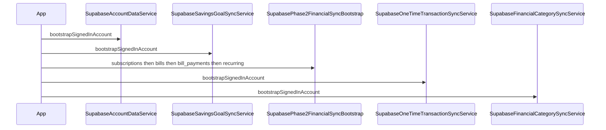

# Supabase Phase 4 Production Deploy + QA Hardening Plan

## Document Status

| Field | Value |
|---|---|
| **Type** | Planning / validation / deployment / QA only |
| **Phase** | 4 — production readiness |
| **Implementation status** | In progress — automated local validation complete; remote deploy blocked on `supabase login` |
| **Swift changes** | None in Phase 4 |
| **Migration changes** | None in Phase 4 |
| **Deploy status** | Do not deploy until go/no-go checklist passes |
| **Execution log** | [supabase_phase4_qa_execution_log.md](./supabase_phase4_qa_execution_log.md) |
| **Runnable scripts** | [scripts/phase4/](../../scripts/phase4/README.md) |

Related specs:

- [supabase_phase4_qa_execution_log.md](./supabase_phase4_qa_execution_log.md) — live QA tracker
- [supabase_phase1_migration_spec.md](./supabase_phase1_migration_spec.md)
- [supabase_phase2_financial_sync_plan.md](./supabase_phase2_financial_sync_plan.md)
- [supabase_phase2b_savings_goals_migration_spec.md](./supabase_phase2b_savings_goals_migration_spec.md)
- [supabase_phase3_categories_transactions_sync_plan.md](./supabase_phase3_categories_transactions_sync_plan.md)
- [supabase_phase3a_one_time_transactions_migration_spec.md](./supabase_phase3a_one_time_transactions_migration_spec.md)
- [supabase_security_performance_hardening_plan.md](./supabase_security_performance_hardening_plan.md)
- [supabase_user_data_architecture_plan.md](./supabase_user_data_architecture_plan.md)

---

## 1. Purpose

This document is a **planning document only** for BudgetMeter Phase 4: production validation, Supabase deployment sequencing, security hardening verification, and manual QA.

Phase 4 does **not**:

- add new sync features
- modify Swift sync services
- create or alter Supabase SQL migrations
- deploy to production without explicit approval
- remove `BackupService`
- remove CloudKit
- redesign UI

Phase 4 **does**:

- define safe deployment order for migrations `0004–0009`
- define RLS and security validation before and after deploy
- define Core Data lightweight migration QA on simulator and real devices
- define end-to-end sync QA flows and entity matrices
- define go/no-go criteria before App Store release with structured Supabase sync

**Context:** Phases 1–3 Swift sync is implemented in the iOS codebase. SQL migrations exist locally under `supabase/migrations/`. Migrations have **not** been runtime-validated on the linked production Supabase project in CI (prior work noted Docker/staging gaps). Phase 4 closes that gap before any live deploy.

---

## 2. Current Implementation Summary

### 2.1 Completed sync phases

| Phase | Remote tables | Swift service(s) | Local persistence impact |
|---|---|---|---|
| **1** | `profiles`, `user_settings`, `notification_preferences` | `SupabaseAccountDataService` | Remote mirror of settings; Core Data `AppSettings` unchanged for sync fields |
| **2B** | `savings_goals` | `SupabaseSavingsGoalSyncService` | Sync metadata on `SavingsGoal` entity (model v4+) |
| **2C** | `subscriptions`, `bills`, `bill_payments`, `recurring_transactions` | `SupabaseSubscriptionSyncService`, `SupabaseBillSyncService`, `SupabaseBillPaymentSyncService`, `SupabaseRecurringTransactionSyncService`, orchestrated by `SupabasePhase2FinancialSyncBootstrap` | Sync metadata on those four entities (model v6) |
| **3A** | `one_time_transactions` | `SupabaseOneTimeTransactionSyncService` | Sidecar `OneTimeTransactionSyncMetadata` (model v5+); overloaded `FinancialCategory` rows for one-time entries |
| **3B** | `financial_categories`, `seeded_category_overrides` | `SupabaseFinancialCategorySyncService` | Sidecar `FinancialCategorySyncMetadata` (model v7) |

### 2.2 Sign-in bootstrap order

Non-blocking `Task` in `AuthService.applySession` — app launch does **not** wait for sync.

Source: [budgetmeter.ios/CoreKit/Sources/Auth/AuthService.swift](../../budgetmeter.ios/CoreKit/Sources/Auth/AuthService.swift)



Phase 2C internal order (from [SupabasePhase2FinancialSyncBootstrap.swift](../../budgetmeter.ios/CoreKit/Sources/Supabase/SupabasePhase2FinancialSyncBootstrap.swift)):

1. subscriptions
2. bills
3. bill_payments
4. recurring_transactions

### 2.3 Infrastructure already in place

| Item | Location / notes |
|---|---|
| SQL migrations | `supabase/migrations/0001` through `0009` |
| delete-account Edge Function | [supabase/functions/delete-account/index.ts](../../supabase/functions/delete-account/index.ts) |
| BackupService (retained) | [budgetmeter.ios/CoreKit/Sources/Backup/BackupService.swift](../../budgetmeter.ios/CoreKit/Sources/Backup/BackupService.swift) |
| CloudKit (retained) | [PersistenceService.swift](../../budgetmeter.ios/CoreKit/Sources/Persistence/PersistenceService.swift) — `NSPersistentCloudKitContainer` |
| Client auth | [SupabaseClientProvider.swift](../../budgetmeter.ios/CoreKit/Sources/Auth/SupabaseClientProvider.swift) — anon key only |
| Core Data current version | `BudgetMeter 7` — [`.xccurrentversion`](../../budgetmeter.ios/BudgetMeter.xcdatamodeld/.xccurrentversion) |
| Linked Supabase project | ref `mqbtbtlbpcjzleghvrkv` — [supabase/.temp/linked-project.json](../../supabase/.temp/linked-project.json) |
| Unit tests | 226 tests passing; sync tests use mock remote stores |

### 2.4 Sync design principles (MVP)

- **Local-first:** writes land in Core Data first; sync is background
- **Last-write-wins:** compare local `lastModified` vs remote `updated_at`
- **Soft delete:** remote `deleted_at` tombstones; no client hard DELETE on financial sync tables
- **Identity:** `client_record_id` (UUID string) for entity rows; `(type, category_key)` for seeded overrides
- **Sidecar metadata:** Phase 3A/3B avoid polluting overloaded `FinancialCategory` with sync fields

### 2.5 Known MVP gaps (accept or defer in Phase 4)

| Gap | Impact | Phase 4 action |
|---|---|---|
| Full-table fetch per sync pass | Slower bootstrap for large accounts | Performance spot-check; defer cursor to Phase 5 |
| Recurring category **amounts** not synced | Cross-device amount drift on custom/seeded slots | Document; QA with eyes open; defer to Phase 5 |
| BillPayment limited local create UI | Restore path less exercised | Manual QA focus on restore |
| No live Supabase integration tests | RLS bugs found only in manual QA | Mandatory live RLS checklist |
| Migrations not applied in CI | Production deploy is first runtime test | Staging/branch validation required |

---

## 3. Supabase Migration Inventory

### 3.1 Primary migrations (Phase 4 deploy scope)

#### 0004 — Phase 1 account/settings

| Field | Detail |
|---|---|
| **File** | [supabase/migrations/0004_phase1_profiles_settings_notifications.sql](../../supabase/migrations/0004_phase1_profiles_settings_notifications.sql) |
| **Purpose** | Account-level settings sync foundation |
| **Tables** | `profiles`, `user_settings`, `notification_preferences` |
| **RLS** | Enabled; authenticated SELECT/INSERT/UPDATE owner-only; **no DELETE policy** (rows deleted via Edge Function) |
| **Triggers** | `set_updated_at` applied in migration 0005 |
| **delete-account** | Deletes all three tables by `user_id` |
| **Deploy risk** | **Medium** — wrong RLS blocks all sign-in sync |

#### 0005 — Shared updated_at triggers

| Field | Detail |
|---|---|
| **File** | [supabase/migrations/0005_phase1_updated_at_triggers.sql](../../supabase/migrations/0005_phase1_updated_at_triggers.sql) |
| **Purpose** | `public.set_updated_at()` function + triggers on Phase 1 tables |
| **Tables** | None (function + triggers on 0004 tables) |
| **RLS** | N/A |
| **Triggers** | Creates/replaces `set_updated_at()`; wires Phase 1 tables |
| **delete-account** | N/A |
| **Deploy risk** | **Low** — idempotent function replace |

#### 0006 — Phase 2B savings goals

| Field | Detail |
|---|---|
| **File** | [supabase/migrations/0006_phase2b_savings_goals.sql](../../supabase/migrations/0006_phase2b_savings_goals.sql) |
| **Purpose** | First structured financial sync table |
| **Tables** | `savings_goals` |
| **RLS** | Enabled; SELECT/INSERT/UPDATE authenticated owner; no client DELETE |
| **Triggers** | `set_savings_goals_updated_at` |
| **delete-account** | Deletes `savings_goals` by `user_id` |
| **Deploy risk** | **Medium** — financial PII begins |

#### 0007 — Phase 3A one-time transactions

| Field | Detail |
|---|---|
| **File** | [supabase/migrations/0007_phase3a_one_time_transactions.sql](../../supabase/migrations/0007_phase3a_one_time_transactions.sql) |
| **Purpose** | One-time income/expense entry sync |
| **Tables** | `one_time_transactions` |
| **RLS** | Enabled; SELECT/INSERT/UPDATE owner; no client DELETE |
| **Triggers** | `set_one_time_transactions_updated_at` |
| **delete-account** | Deletes `one_time_transactions` by `user_id` |
| **Deploy risk** | **Medium** — denormalized `category_label` snapshots |

#### 0008 — Phase 2C subscriptions, bills, recurring

| Field | Detail |
|---|---|
| **File** | [supabase/migrations/0008_phase2c_subscriptions_bills_recurring.sql](../../supabase/migrations/0008_phase2c_subscriptions_bills_recurring.sql) |
| **Purpose** | Remaining Phase 2 structured financial entities |
| **Tables** | `subscriptions`, `bills`, `bill_payments`, `recurring_transactions` |
| **RLS** | Enabled per table; SELECT/INSERT/UPDATE owner; no client DELETE |
| **Triggers** | `set_updated_at` per table |
| **delete-account** | Deletes all four; **`bill_payments` first** (child-before-parent) |
| **Deploy risk** | **High** — four tables in one migration; ordering matters for delete-account |

#### 0009 — Phase 3B categories

| Field | Detail |
|---|---|
| **File** | [supabase/migrations/0009_phase3b_financial_categories.sql](../../supabase/migrations/0009_phase3b_financial_categories.sql) |
| **Purpose** | Custom reusable categories + seeded category overrides |
| **Tables** | `financial_categories`, `seeded_category_overrides` |
| **RLS** | Enabled per table; SELECT/INSERT/UPDATE owner; no client DELETE |
| **Triggers** | `set_updated_at` per table |
| **delete-account** | Deletes both after `one_time_transactions` |
| **Deploy risk** | **Medium** — depends on Phase 3A category reference stability |

### 3.2 Prerequisite migrations (backup; deploy before or with Phase 4)

| Migration | Purpose | Tables | DELETE policy |
|---|---|---|---|
| **0001** | Manual backup latest row | `user_backups` | Yes — user can delete own backup |
| **0002** | Backup version history | `user_backup_versions` | Yes |
| **0003** | Backup capture trigger | (trigger on `user_backups`) | N/A |

These predate structured sync but are required for `BackupService` and delete-account cleanup.

### 3.3 Cross-cutting patterns (0006–0009)

- RLS: `authenticated` role only; owner match via `auth.uid() = user_id`
- No anonymous policies
- No client DELETE policies on financial sync tables — tombstones via `deleted_at` upsert
- Unique constraints prevent duplicate `client_record_id` per user
- Indexes: `(user_id, updated_at desc)`, `(user_id, deleted_at)`, `(user_id, client_record_id)` where applicable

### 3.4 delete-account dependency map

Order enforced in [delete-account/index.ts](../../supabase/functions/delete-account/index.ts):

```
bill_payments
  → bills
  → subscriptions
  → recurring_transactions
  → one_time_transactions
  → financial_categories
  → seeded_category_overrides
  → savings_goals
  → notification_preferences
  → user_settings
  → profiles
  → user_backup_versions
  → user_backups
  → auth.users (last)
```

**Validation:** every user-owned table in §6 must appear in this list.

---

## 4. Deployment Plan

All commands below are **suggestions only — DO NOT RUN until approved.**

### Step 1 — Backup current Supabase project state

```bash
# DO NOT RUN until approved
# Confirm linked project
supabase projects list

# Document applied migrations
supabase migration list

# Export schema snapshot (requires DB connection)
supabase db dump --schema-only -f pre_phase4_schema.sql
```

Also use Supabase Dashboard → Database → Backups / point-in-time recovery if available on plan tier.

### Step 2 — Static SQL review

Before any apply:

- [ ] Read 0004–0009 end-to-end
- [ ] Confirm every `NOT VALID` constraint has matching `VALIDATE` block
- [ ] Confirm RLS enabled on every user table
- [ ] Confirm no `SECURITY DEFINER` functions exposed via PostgREST (0001 drops `delete_own_account()` intentionally)
- [ ] Cross-check delete-account table list vs migration inventory
- [ ] Confirm no service role key references in iOS source

### Step 3 — Staging / local validation (preferred)

**Option A — Local Docker:**

```bash
# DO NOT RUN until approved
supabase start
supabase db reset
# Runs all migrations from supabase/migrations/
```

Then run RLS checklist (§6) against local instance.

**Option B — Supabase branch project:**

Create a disposable branch linked to the same repo; apply migrations there first. Do **not** use production for first apply.

### Step 4 — Apply migrations to production

```bash
# DO NOT RUN until approved
# Verify link points to production ref mqbtbtlbpcjzleghvrkv
cat supabase/.temp/linked-project.json

# Apply pending migrations
supabase db push
```

Alternative: paste one migration at a time in Dashboard SQL editor with documented rollback notes.

**Order:** migrations apply in filename order (`0001` → `0009`). Do not skip.

### Step 5 — Deploy delete-account Edge Function

```bash
# DO NOT RUN until approved
supabase functions deploy delete-account
```

Verify function environment secrets (Dashboard → Edge Functions → delete-account → Secrets):

- `SUPABASE_URL`
- `SUPABASE_ANON_KEY`
- `SUPABASE_SERVICE_ROLE_KEY` (server-side only)

Confirm iOS contract: [AccountDeletionClientTests.swift](../../budgetmeter.iosTests/AccountDeletionClientTests.swift) — POST with `Authorization: Bearer <access_token>` and `apikey: <anon_key>`.

### Step 6 — Post-deploy DB verification

Via Dashboard SQL or `psql`:

```sql
-- DO NOT RUN until approved — review queries first
SELECT tablename, rowsecurity FROM pg_tables WHERE schemaname = 'public' ORDER BY tablename;

SELECT schemaname, tablename, policyname, cmd, roles
FROM pg_policies WHERE schemaname = 'public' ORDER BY tablename;

SELECT tgname, relname FROM pg_trigger t
JOIN pg_class c ON t.tgrelid = c.oid
JOIN pg_namespace n ON c.relnamespace = n.oid
WHERE n.nspname = 'public' AND NOT t.tgisinternal;
```

Pass criteria:

- 13 user-owned tables exist with RLS `true`
- Financial tables have SELECT/INSERT/UPDATE policies for `authenticated` only
- No unexpected `anon` write policies on financial tables
- `set_updated_at` triggers present on tables with `updated_at` column

### Step 7 — iOS app testing

Only after Steps 4–6 pass. Use TestFlight or ad-hoc build pointing at production Supabase project.

---

## 5. Pre-Deploy Checklist

- [ ] Supabase CLI linked to **production** project ref `mqbtbtlbpcjzleghvrkv` (not a dev/staging project by mistake)
- [ ] [SupabaseConfig.swift](../../budgetmeter.ios/CoreKit/Sources/Auth/SupabaseConfig.swift) `projectID` matches deployed project
- [ ] App uses **anon key only** — [SupabaseClientProvider](../../budgetmeter.ios/CoreKit/Sources/Auth/SupabaseClientProvider.swift) never references service role
- [ ] Service role key stored only in Edge Function secrets / CI vault — not in git, not in app bundle
- [ ] Migration files ordered `0001` → `0009`; no duplicate version numbers
- [ ] Pending migrations identified via `supabase migration list` before push
- [ ] delete-account function code reviewed; deploy path documented
- [ ] JWT verification behavior confirmed (function validates Bearer token via `auth.getUser()`)
- [ ] Rollback approach understood (§13): forward-fix migrations, not destructive prod revert
- [ ] Team agrees Phase 4 is validation-only — **no UI/copy code changes** (copy review is checklist-only)
- [ ] Staging or branch validation completed before production push

---

## 6. RLS / Security Validation Plan

### 6.1 Tables to validate

| # | Table | Migration | Client DELETE policy |
|---|---|---|---|
| 1 | `profiles` | 0004 | No |
| 2 | `user_settings` | 0004 | No |
| 3 | `notification_preferences` | 0004 | No |
| 4 | `savings_goals` | 0006 | No |
| 5 | `subscriptions` | 0008 | No |
| 6 | `bills` | 0008 | No |
| 7 | `bill_payments` | 0008 | No |
| 8 | `recurring_transactions` | 0008 | No |
| 9 | `one_time_transactions` | 0007 | No |
| 10 | `financial_categories` | 0009 | No |
| 11 | `seeded_category_overrides` | 0009 | No |
| 12 | `user_backups` | 0001 | Yes (intentional) |
| 13 | `user_backup_versions` | 0002 | Yes (intentional) |

### 6.2 Per-table test matrix

Use two test accounts: **User A** and **User B**. Record results in a spreadsheet.

| Test ID | Test | Method | Pass criteria |
|---|---|---|---|
| SEC-01 | Anonymous read | PostgREST GET without JWT | 401 or zero rows |
| SEC-02 | Anonymous insert | PostgREST POST without JWT | Denied |
| SEC-03 | A reads own data | GET with A token | Rows returned; all `user_id = A` |
| SEC-04 | A cannot read B | GET filtering B's `user_id` | Zero rows |
| SEC-05 | A cannot update B | PATCH B row UUID | Zero rows updated / policy error |
| SEC-06 | A cannot insert as B | POST with `user_id: B` | RLS violation |
| SEC-07 | Soft delete path | Upsert with `deleted_at` as A | Succeeds for A's row |
| SEC-08 | Client hard DELETE | DELETE on 0006–0009 table | Denied or no DELETE policy |
| SEC-09 | Service role not in app | Inspect app binary / source | Anon key only |

Repeat SEC-01 through SEC-08 for **each** of the 13 tables (adjust SEC-08 for backup tables where DELETE is allowed for owner).

### 6.3 delete-account validation

| Test ID | Test | Pass criteria |
|---|---|---|
| DEL-01 | Authenticated delete | POST delete-account with valid A token → `{ deleted: true }` |
| DEL-02 | No token | 401 |
| DEL-03 | Post-delete data sweep | All 13 tables empty for A's `user_id` |
| DEL-04 | Auth user removed | A cannot sign in again |
| DEL-05 | B unaffected | B's rows still present after A deletion |
| DEL-06 | Idempotency | Second delete call on removed user → 401 |

### 6.4 Reference

See [supabase_security_performance_hardening_plan.md](./supabase_security_performance_hardening_plan.md) for policy patterns and indexing expectations.

---

## 7. Core Data Migration QA Plan

Persistence uses lightweight migration with `shouldMigrateStoreAutomatically = true` and `shouldInferMappingModelAutomatically = true` in [PersistenceService.swift](../../budgetmeter.ios/CoreKit/Sources/Persistence/PersistenceService.swift).

### 7.1 Version ladder

| Upgrade | Model | Schema change |
|---|---|---|
| → v4 | BudgetMeter 4 | `SavingsGoal` sync fields (`syncStatus`, `lastSyncedAt`, `remoteUpdatedAt`, `deletedAt`, `lastSyncError`) |
| → v5 | BudgetMeter 5 | New sidecar `OneTimeTransactionSyncMetadata` (`syncable="NO"`) |
| → v6 | BudgetMeter 6 | Sync fields on `Subscription`, `Bill`, `BillPayment`, `RecurringTransaction` |
| → v7 | BudgetMeter 7 | New sidecar `FinancialCategorySyncMetadata` (`syncable="NO"`) |

Production users may jump from v3 (or earlier) directly to v7 in one app update.

### 7.2 Test matrix

| ID | Starting state | Environment | Steps | Pass criteria |
|---|---|---|---|---|
| CD-01 | Pre-sync App Store build (~v3) with populated data | Real device | Install old → upgrade to sync build → launch | No crash; all existing data visible |
| CD-02 | v3 store with savings, bills, subs, categories | Simulator | Upgrade to v7 build | All entity counts match pre-upgrade |
| CD-03 | v3 store with one-time entries | Simulator + device | Upgrade | One-time rows retained; amounts/dates correct |
| CD-04 | Tombstoned one-time rows (sidecar from partial sync) | Simulator | Upgrade | Tombstoned rows stay hidden in UI |
| CD-05 | Tombstoned custom recurring category | Simulator | Upgrade | Custom category stays hidden |
| CD-06 | Fresh install sync build | Simulator | First launch | Seeded categories seed (~58 rows); no crash |
| CD-07 | iCloud signed in | Real device | Upgrade with CloudKit available | No crash loop; local data intact |
| CD-08 | iCloud off | Real device | Upgrade | Same as CD-01 |
| CD-09 | Repeated launch | Either | Launch app 5× after upgrade | No migration re-run crash |

### 7.3 Validation checklist

- [ ] No data loss on first launch after upgrade
- [ ] No Core Data migration crash loop
- [ ] Sidecar entities exist but are invisible in UI
- [ ] Seeded category `uniqueID` keys and local amounts preserved
- [ ] Custom categories retain names, icons, colors
- [ ] Savings goals, bills, subscriptions, recurring transactions counts unchanged
- [ ] Widget/summary calculations still correct after upgrade

### 7.4 Simulator procedure (CD-02 example)

1. Install build **without** sync (or use archived build) on simulator
2. Populate: 3 savings goals, 2 bills, 2 subscriptions, 5 one-time entries, 2 custom categories
3. Note counts and spot-check amounts
4. Install sync build over the top (same bundle ID, upgrade path)
5. Launch — confirm no crash
6. Verify all counts and spot-check values

### 7.5 Real-device procedure (CD-01)

1. Use TestFlight or device with production-like data from daily use
2. Before upgrade: export manual backup via BackupService (safety net)
3. Upgrade to sync-enabled build
4. Verify home meter, income/expense tabs, savings, bills, settings
5. Sign in and allow bootstrap to complete (background)
6. Re-verify data after 60 seconds

---

## 8. End-to-End Sync QA Plan

### E2E-01 — Fresh install + sign in

1. Delete app; install sync build
2. Complete onboarding; create sample data locally
3. Sign in with new account
4. **Expected:** local data uploads; remote rows appear in Supabase Dashboard for that user
5. **Expected:** seeded categories are **not** duplicated remotely (only overrides/custom upload)

### E2E-02 — Existing local data + sign in

1. Use device with local data **before** first sign-in
2. Sign in
3. **Expected:** app remains responsive during bootstrap
4. **Expected:** local rows upload; no UI freeze
5. Verify in Dashboard: rows for each entity type

### E2E-03 — Reinstall + sign in restores data

1. Populate account on Device A; wait for sync
2. Delete app on Device B (or same device); reinstall
3. Sign in same account
4. **Expected:** savings, bills, subs, recurring, one-time, custom categories, overrides restore
5. **Expected:** seeded catalog recreated locally from app seed; overrides merge onto seeded rows

### E2E-04 — Offline create → online sync

1. Sign in; confirm synced state
2. Enable airplane mode
3. Create savings goal + one-time expense + custom recurring category
4. Disable airplane mode
5. **Expected:** pending rows upload within one bootstrap cycle
6. **Expected:** local data never lost on failure

### E2E-05 — Online update persists remotely

1. Edit savings goal amount, bill name, subscription amount, one-time entry, custom category color
2. Query Supabase Dashboard
3. **Expected:** `updated_at` changed; values match

### E2E-06 — Delete / tombstone sync

1. Delete savings goal, one-time entry, custom recurring category, subscription, bill
2. **Expected:** local row hidden/tombstoned; remote `deleted_at` set
3. Reinstall + sign in
4. **Expected:** deleted items do not reappear

### E2E-07 — Sign out / sign in idempotency

1. Sign in; sync complete
2. Sign out
3. Sign in again
4. **Expected:** no duplicate rows in Dashboard (unique constraints hold)
5. **Expected:** counts unchanged

### E2E-08 — Second device simulation

1. Device A: create diverse dataset; sync
2. Device B (or simulator): fresh install; sign in same account
3. **Expected:** remote rows restore locally
4. Device B: edit one goal (newer timestamp)
5. Device A: sign in again
6. **Expected:** LWW — Device B change wins for that row

### E2E-09 — User A / User B isolation

1. Sign in as User A; create data
2. Sign out; sign in as User B; create different data
3. **Expected:** B never sees A's data in app
4. Dashboard: row counts per user isolated

---

## 9. Entity-by-Entity QA Matrix

Legend: **P** = pass required before go-live; **QA** = extra attention; **N/A** = not applicable

| Entity | Create | Update | Delete/tombstone | Reinstall restore | Offline→online | Duplicate prevention |
|---|---|---|---|---|---|---|
| **settings** | P | P | N/A | P | P | P — one row per `user_id` |
| **notification prefs** | P | P | N/A | P | P | P — one row per `user_id` |
| **savings goals** | P | P | P | P | P | P — unique `(user_id, client_record_id)` |
| **subscriptions** | P | P | P | P | P | P — unique `(user_id, client_record_id)` |
| **bills** | P | P | P | P | P | P — unique `(user_id, client_record_id)` |
| **bill payments** | QA | QA | P | P | P | P — unique `(user_id, client_record_id)` |
| **recurring transactions** | P | P | P | P | P | P — unique `(user_id, client_record_id)` |
| **one-time income/expense** | P | P | P | P | P | P — unique `(user_id, client_record_id)` |
| **custom categories** | P | P color/name | P | P | P | P — unique `(user_id, client_record_id)` |
| **seeded overrides** | P — override only | P | P — clear override | P | P | P — unique `(user_id, type, category_key)` |

### Special cases

| Case | Expected behavior |
|---|---|
| Custom category **amounts** | Stay local in Phase 3B; cross-device amount may differ — **document as known limitation** |
| Seeded override | Applies to all local rows matching `(type, uniqueID)` across frequencies |
| One-time `category_label` | Snapshot at entry time; survives category delete/tombstone |
| Seeded catalog | Never uploaded as 58 duplicate rows; app re-seeds locally per install |
| Settings conflict | LWW between local `AppSettings` and remote `user_settings` via Phase 1 service |

---

## 10. BackupService Overlap Plan

### 10.1 Current architecture

| Mechanism | What it does | When it runs |
|---|---|---|
| **Structured sync** (Phases 1–3) | Per-entity upsert to normalized tables | Sign-in bootstrap + mutation `scheduleSync()` |
| **BackupService** | Full Core Data JSON snapshot to `user_backups` + version history | Manual user action; premium + signed in |

Source: [BackupService.swift](../../budgetmeter.ios/CoreKit/Sources/Backup/BackupService.swift), [AccountBackupSettingsView.swift](../../budgetmeter.ios/Features/SettingsFeature/View/AccountBackupSettingsView.swift)

### 10.2 Overlap risks

| Risk | Description |
|---|---|
| User confusion | Screen title "Account & Backup" implies all data is cloud-backed automatically |
| Dual source of truth | Structured sync + manual backup JSON may diverge |
| Restore vs sync conflict | Restore **replaces local** without dedupe against Supabase — can create duplicates or stale overwrites |
| QA burden | Must test backup/restore **and** structured sync independently |

### 10.3 Copy / UX guidelines (review only — no Phase 4 UI changes)

When copy is updated (Phase 5), distinguish:

- **Account sync:** "Your signed-in account keeps settings and financial data in sync across devices."
- **Manual backup:** "Create a full snapshot you can restore manually. This is separate from everyday sync."

Avoid:

- "Everything is automatically backed up to the cloud"
- "Your data is always safe in the cloud" (without defining sync scope)

### 10.4 Phase 4 QA for backup overlap

- [ ] Run manual backup **after** structured sync stable — backup JSON includes current local state
- [ ] Restore to clean device — still works (BackupService path)
- [ ] Restore on device with Supabase sync — document any duplicate/conflict observed
- [ ] delete-account removes both structured rows **and** `user_backups` / `user_backup_versions`

### 10.5 What stays in Phase 4

- **Do not remove BackupService**
- **Do not disable CloudKit**
- **Do not merge** backup and structured sync code paths

Phase 5 candidate: deprecate manual backup after production QA window confirms reinstall + sync sufficient.

---

## 11. CloudKit Retention Risk

### 11.1 Why CloudKit remains

- [PersistenceService.swift](../../budgetmeter.ios/CoreKit/Sources/Persistence/PersistenceService.swift) uses `NSPersistentCloudKitContainer`
- Existing users may have iCloud container history
- Removal requires dedicated migration project — out of Phase 4 scope

### 11.2 Dual-sync risks

| Risk | Detail |
|---|---|
| Expectation mismatch | Users may think iCloud and Supabase are the same backup |
| Entity overlap | Core Data entities marked `syncable="YES"` may participate in CloudKit export |
| Sidecar isolation | `OneTimeTransactionSyncMetadata`, `FinancialCategorySyncMetadata` are `syncable="NO"` — Supabase-only (correct) |
| Conflict resolution | CloudKit merge policy vs Supabase LWW — not unified |

### 11.3 Phase 4 verification

- [ ] Upgrade with iCloud signed in — no crash
- [ ] Upgrade with iCloud off — no crash
- [ ] Supabase sign-in works when `isCloudKitAvailable == false`
- [ ] Document: **do not remove CloudKit in Phase 4**

Phase 5 candidate: CloudKit isolation or removal strategy with explicit user communication.

---

## 12. Performance Validation Plan

### 12.1 Current behavior

| Area | Implementation | MVP acceptable? |
|---|---|---|
| Sync fetch | Full `SELECT * WHERE user_id = ?` per table per bootstrap | Yes for < few thousand rows/user |
| Incremental cursor | Not implemented | Defer to Phase 5 |
| Bootstrap | Sequential async in non-blocking `Task` | Yes |
| UI thread | `@MainActor` reconcile on `viewContext` | Monitor for jank on large restores |
| Bill payments | Extra fetch of bills for context | Acceptable; watch bill-heavy accounts |
| Indexes | `(user_id, updated_at)`, `(user_id, deleted_at)`, `(user_id, client_record_id)` | Verify with EXPLAIN if slow |

### 12.2 Benchmark scenarios

Run on simulator and one real device:

| Scenario | Dataset | Metric | Target |
|---|---|---|---|
| PERF-01 | Empty account | Sign-in to bootstrap complete | < 3s perceived; UI never blocks |
| PERF-02 | 20 savings goals, 10 bills, 10 subs | Bootstrap duration | < 10s background |
| PERF-03 | 100+ one-time transactions | Bootstrap duration | < 15s background; no UI freeze |
| PERF-04 | Repeated sign-in × 3 | Row counts in Dashboard | No duplicate rows |
| PERF-05 | Large restore on Device B | Time to populate UI | Lists populate progressively; no crash |

### 12.3 Post-deploy SQL checks

```sql
-- DO NOT RUN until approved — example EXPLAIN for slow path
EXPLAIN ANALYZE
SELECT * FROM public.one_time_transactions
WHERE user_id = '<test-user-uuid>';
```

---

## 13. Failure / Recovery Plan

| Failure | Detection | Mitigation |
|---|---|---|
| Migration fails mid-apply | CLI/Dashboard error | Stop; diagnose; ship forward-fix migration; do not hand-edit prod schema |
| RLS too strict | App empty reads, sync errors | Hotfix policy migration; test on branch first |
| RLS too loose | Security audit / cross-user QA fail | Emergency policy tighten; rotate keys if exposure suspected |
| App sync error | `syncStatus = failed` in Core Data / sidecar | Local data retained; retries on next bootstrap |
| Partial upload | Incomplete remote state after offline | Re-sign-in; pending rows re-upload |
| delete-account 500 | Edge Function logs | User data remains; manual service-role cleanup; fix function |
| Offline queue | Pending metadata after reconnect | Expected; verify upload within one session |
| Duplicate rows | Dashboard duplicate `client_record_id` | Should be blocked by unique index; file bug if seen |
| Core Data migration crash | Launch crash after upgrade | Stop rollout; investigate mapping; offer previous build |
| Supabase unavailable | Network errors in console | Local-first continues; sync skipped gracefully |

### Rollback strategy

| Layer | Rollback approach |
|---|---|
| **Database** | Restore from Supabase backup / PITR — not `git revert` of applied SQL on prod |
| **Edge Function** | Redeploy previous function version from git tag |
| **iOS app** | Pull previous App Store version; users on sync build may need support guidance |
| **Forward fix** | Preferred over rollback for additive migrations |

---

## 14. Privacy / App Store Readiness

### 14.1 Data now stored in Supabase

When signed in, the app syncs:

- Account profile and settings
- Notification preferences
- Savings goals, subscriptions, bills, bill payments, recurring transactions
- One-time income/expense entries
- Custom categories and seeded category overrides
- Manual backup JSON (if user triggers backup)

All stored in user-owned rows protected by RLS.

### 14.2 App Store Privacy Nutrition Labels

Review and likely update:

- **Financial Info** — collected, linked to user, used for app functionality
- **User ID** — collected for account/sign-in
- **Data linked to user** — yes for synced entities

### 14.3 Privacy policy updates

Policy should state:

- What categories of financial data are stored
- That storage is in Supabase (cloud database) tied to authenticated account
- Account deletion removes user data (link to in-app delete flow)
- Manual backup is optional and separate from everyday sync
- No claim of end-to-end encryption unless actually implemented

### 14.4 Marketing copy rules

Do **not** claim:

- "End-to-end encrypted" (unless added)
- "All data automatically backed up" (structured sync ≠ full device mirror)
- "We cannot see your data" (operator can access Supabase with service role)

---

## 15. Production Logging Rules

Current sync services log via `print("☁️ ...")` with error descriptions — acceptable for MVP with rules:

### Never log

- JWT / access tokens / refresh tokens
- Service role key
- Full request/response JSON bodies
- Dollar amounts, balances, salary values
- Full backup payloads
- Email addresses in production (prefer user id prefix only)

### Safe to log

- Sync pass started/completed per service name
- Table name being synced
- Error type / localized description without payload
- Truncated `client_record_id` prefix (first 8 chars) for correlation
- "sync skipped (not authenticated)" class messages

### Phase 5 hardening

- Gate verbose logs behind `#if DEBUG`
- Crash reporting: no financial values in breadcrumbs
- Structured os_log with privacy `.private` for any user-derived strings

---

## 16. Final Go/No-Go Checklist

All items must pass before production release and App Store submission of sync-enabled build.

### Database and backend

- [ ] Migrations 0001–0009 applied to production (or 0004–0009 if 0001–0003 already live)
- [ ] Post-deploy verification queries pass (§4 Step 6)
- [ ] delete-account Edge Function deployed
- [ ] delete-account secrets configured
- [ ] RLS validated — SEC-01 through SEC-09 pass for all 13 tables
- [ ] delete-account validated — DEL-01 through DEL-06 pass

### iOS and data

- [ ] Core Data v3→v7 upgrade validated on real device (CD-01 minimum)
- [ ] Core Data upgrade validated on simulator (CD-02 through CD-06)
- [ ] End-to-end sync QA passed (E2E-01 through E2E-09)
- [ ] Entity matrix passed (§9)
- [ ] Reinstall restore passed (E2E-03)
- [ ] Offline→online passed (E2E-04)
- [ ] Second device / LWW passed (E2E-08)
- [ ] User isolation passed (E2E-09)

### Product and compliance

- [ ] Privacy policy reviewed/updated
- [ ] App Store Privacy Nutrition Labels reviewed/updated
- [ ] BackupService overlap understood; copy review completed (no false "auto backup" claims)
- [ ] Known MVP risks explicitly accepted (see §2.5)

### Performance and ops

- [ ] Performance spot-check passed (PERF-01 through PERF-03 minimum)
- [ ] Production logging rules communicated to team (§15)
- [ ] Rollback plan documented and understood (§13)

**Go decision:** all boxes checked → proceed to release.  
**No-go:** any critical SEC/DEL/CD/E2E failure → fix forward before release.

---

## 17. Recommended Execution Order

| Step | Activity | Owner | Output |
|---|---|---|---|
| 1 | Pre-deploy checklist (§5) | Engineering | Signed checklist |
| 2 | Static SQL + delete-account review | Engineering | Review notes |
| 3 | Staging/branch migration apply | Engineering | Green staging |
| 4 | RLS security validation (§6) | Engineering + QA | SEC/DEL test log |
| 5 | Production migration apply | Engineering (approved) | Migration list clean |
| 6 | Deploy delete-account function | Engineering (approved) | Function live |
| 7 | Post-deploy DB verification | Engineering | SQL audit log |
| 8 | Core Data migration QA — simulator | QA | CD test log |
| 9 | Core Data migration QA — real device | QA | CD-01 pass |
| 10 | End-to-end sync QA (§8–§9) | QA | E2E test log |
| 11 | Performance spot-check (§12) | QA/Engineering | PERF notes |
| 12 | Privacy/copy review (§14) | Product/Legal | Updated policy/labels |
| 13 | Go/no-go meeting (§16) | Team | Go or no-go record |

**Do not skip Steps 3–4 before Step 5.**

---

## 18. Final Recommendation

### Should we deploy now?

**No.** Implementation is ready for **staging validation**, not production release.

Code readiness:

- Swift sync services for Phases 1–3 are implemented
- 226 unit tests pass with mock remote stores
- delete-account function code matches table inventory
- Core Data model v7 with sidecar metadata is in place

Gaps blocking production:

- Migrations not runtime-validated on linked production project
- No live Supabase RLS integration test suite
- Real-device Core Data upgrade from pre-sync builds not yet verified
- Full manual QA matrix not yet executed
- Privacy policy and App Store labels not yet updated

### Before production release (Phase 4 must complete)

1. Apply and verify migrations on staging or branch
2. Live RLS A/B testing on all 13 tables
3. Real-device Core Data upgrade from v3-era stores
4. Full manual QA matrix (§8–§9)
5. delete-account end-to-end on staging then production
6. Privacy/compliance review

### Phase 5 candidates (after production QA window)

| Item | Description |
|---|---|
| BackupService deprecation | Remove manual backup once sync + reinstall proven |
| CloudKit strategy | Isolate or remove with user communication |
| Incremental sync cursors | Reduce full-table fetch cost |
| Recurring category amount sync | Close cross-device amount gap |
| Production log sanitization | `#if DEBUG` gating, os_log privacy |
| Live Supabase CI tests | Automated RLS regression |
| UX copy update | Clarify sync vs manual backup in Account settings |

---

## Appendix A — Key source files

| Concern | Path |
|---|---|
| Sign-in bootstrap | [AuthService.swift](../../budgetmeter.ios/CoreKit/Sources/Auth/AuthService.swift) |
| Phase 1 sync | [SupabaseAccountDataService.swift](../../budgetmeter.ios/CoreKit/Sources/Supabase/SupabaseAccountDataService.swift) |
| Phase 2B sync | [SupabaseSavingsGoalSyncService.swift](../../budgetmeter.ios/CoreKit/Sources/Supabase/SupabaseSavingsGoalSyncService.swift) |
| Phase 2C bootstrap | [SupabasePhase2FinancialSyncBootstrap.swift](../../budgetmeter.ios/CoreKit/Sources/Supabase/SupabasePhase2FinancialSyncBootstrap.swift) |
| Phase 3A sync | [SupabaseOneTimeTransactionSyncService.swift](../../budgetmeter.ios/CoreKit/Sources/Supabase/SupabaseOneTimeTransactionSyncService.swift) |
| Phase 3B sync | [SupabaseFinancialCategorySyncService.swift](../../budgetmeter.ios/CoreKit/Sources/Supabase/SupabaseFinancialCategorySyncService.swift) |
| delete-account | [delete-account/index.ts](../../supabase/functions/delete-account/index.ts) |
| Manual backup | [BackupService.swift](../../budgetmeter.ios/CoreKit/Sources/Backup/BackupService.swift) |
| Core Data stack | [PersistenceService.swift](../../budgetmeter.ios/CoreKit/Sources/Persistence/PersistenceService.swift) |
| Supabase config | [SupabaseConfig.swift](../../budgetmeter.ios/CoreKit/Sources/Auth/SupabaseConfig.swift) |
| Migrations | [supabase/migrations/](../../supabase/migrations/) |

## Appendix B — Test files (unit level only)

| Area | Test file |
|---|---|
| Phase 1 | [SupabaseAccountDataServiceTests.swift](../../budgetmeter.iosTests/SupabaseAccountDataServiceTests.swift) |
| Phase 2B | [SupabaseSavingsGoalSyncServiceTests.swift](../../budgetmeter.iosTests/SupabaseSavingsGoalSyncServiceTests.swift) |
| Phase 2C | [SupabasePhase2FinancialSyncServiceTests.swift](../../budgetmeter.iosTests/SupabasePhase2FinancialSyncServiceTests.swift) |
| Phase 3A | [SupabaseOneTimeTransactionSyncServiceTests.swift](../../budgetmeter.iosTests/SupabaseOneTimeTransactionSyncServiceTests.swift) |
| Phase 3B | [SupabaseFinancialCategorySyncServiceTests.swift](../../budgetmeter.iosTests/SupabaseFinancialCategorySyncServiceTests.swift) |
| delete-account client | [AccountDeletionClientTests.swift](../../budgetmeter.iosTests/AccountDeletionClientTests.swift) |
| Backup serialization | [BackupSerializerTests.swift](../../budgetmeter.iosTests/BackupSerializerTests.swift) |

Unit tests validate mapper/reconcile logic with mocks. Phase 4 manual QA validates live Supabase behavior.
